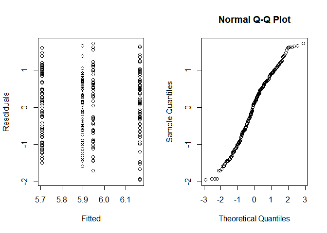
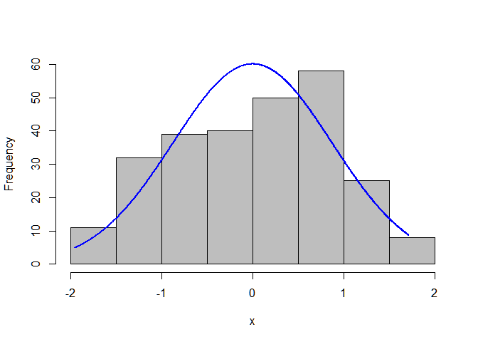

Two Way Anova
================

## Two Way ANOVA

Here is where we will do Two Way ANOVA, with League and Division as the
two categorical variables.

``` r
# will replace this when master .rmd file does transform.
hitters <- read_csv("Hitters.csv")
```

    ## Parsed with column specification:
    ## cols(
    ##   .default = col_double(),
    ##   League = col_character(),
    ##   Division = col_character(),
    ##   NewLeague = col_character()
    ## )

    ## See spec(...) for full column specifications.

``` r
hitters$Division <- as.factor(hitters$Division)
hitters$League   <- as.factor(hitters$League)

for_anova <- hitters %>% dplyr::filter(!is.na(Salary)) %>% dplyr::select(Salary,Division,League) %>%
  dplyr::mutate(logs = log(Salary))
```

### Hypotheses

For The Division: Hl0: The mean of the log salary is the same between
East and West. Hla: The mean of the log salary is different between East
and West.

For The League: Hd0: The mean of the log salary is the same between
American and National Hda: The mean of the log salary is different
between American and National

For Interaction:

### Check Assumptions

The populations from which the samples were obtained must be normally or
approximately normally distributed. The samples must be independent. The
variances of the populations must be equal. The groups must have the
same sample size.

This summary shows that the groups have very nearly the same sample
size. The standard deviations are also nearly the
    same.

``` r
Summarize(logs ~ League + Division,data=for_anova)
```

    ##   League Division  n     mean        sd      min       Q1   median
    ## 1      A        E 68 6.167420 0.8943525 4.212128 5.592944 6.277572
    ## 2      N        E 61 5.946578 0.9430331 4.248495 5.075174 6.109248
    ## 3      A        W 71 5.707746 0.8463934 4.219508 5.010079 5.783825
    ## 4      N        W 63 5.896563 0.8292231 4.317488 5.322712 6.109248
    ##         Q3      max
    ## 1 6.790358 7.807917
    ## 2 6.620073 7.662624
    ## 3 6.396930 7.313220
    ## 4 6.603266 7.549609

These plots of histograms and box plots help confirm that the variances
are the
    same.

``` r
for_anova %>% dplyr::select(logs,Division,League) %>% ggpairs()
```

    ## `stat_bin()` using `bins = 30`. Pick better value with `binwidth`.
    ## `stat_bin()` using `bins = 30`. Pick better value with `binwidth`.

<!-- -->

``` r
hitters_aov.fit<-aov(logs~Division+League+Division:League,data=for_anova)
summary(hitters_aov.fit)
```

    ##                  Df Sum Sq Mean Sq F value Pr(>F)  
    ## Division          1   4.67   4.667   6.052 0.0145 *
    ## League            1   0.01   0.010   0.013 0.9107  
    ## Division:League   1   2.75   2.749   3.564 0.0602 .
    ## Residuals       259 199.73   0.771                 
    ## ---
    ## Signif. codes:  0 '***' 0.001 '**' 0.01 '*' 0.05 '.' 0.1 ' ' 1

Make all pairwise comparisons

``` r
TukeyHSD(hitters_aov.fit,"Division:League",conf.level=.95)
```

    ##   Tukey multiple comparisons of means
    ##     95% family-wise confidence level
    ## 
    ## Fit: aov(formula = logs ~ Division + League + Division:League, data = for_anova)
    ## 
    ## $`Division:League`
    ##                diff        lwr         upr     p adj
    ## W:A-E:A -0.45967382 -0.8449628 -0.07438483 0.0120230
    ## E:N-E:A -0.22084160 -0.6212824  0.17959919 0.4842307
    ## W:N-E:A -0.27085697 -0.6679331  0.12621913 0.2932266
    ## E:N-W:A  0.23883222 -0.1575879  0.63525235 0.4046603
    ## W:N-W:A  0.18881685 -0.2042042  0.58183787 0.6005412
    ## W:N-E:N -0.05001537 -0.4579011  0.35787032 0.9889454

The only statistically significant difference is in the American League,
between the East and West.

``` r
par(mfrow=c(1,2))
plot(hitters_aov.fit$fitted.values,hitters_aov.fit$residuals,ylab="Resdiduals",xlab="Fitted")
qqnorm(hitters_aov.fit$residuals)
```

<!-- -->

Define a linear
model

``` r
two_way_anova_model = lm(logs ~ Division + League + Division:League,data=for_anova)
summary(two_way_anova_model)
```

    ## 
    ## Call:
    ## lm(formula = logs ~ Division + League + Division:League, data = for_anova)
    ## 
    ## Residuals:
    ##     Min      1Q  Median      3Q     Max 
    ## -1.9553 -0.6471  0.1317  0.6891  1.7161 
    ## 
    ## Coefficients:
    ##                   Estimate Std. Error t value Pr(>|t|)    
    ## (Intercept)         6.1674     0.1065  57.915  < 2e-16 ***
    ## DivisionW          -0.4597     0.1490  -3.085  0.00226 ** 
    ## LeagueN            -0.2208     0.1549  -1.426  0.15506    
    ## DivisionW:LeagueN   0.4097     0.2170   1.888  0.06015 .  
    ## ---
    ## Signif. codes:  0 '***' 0.001 '**' 0.01 '*' 0.05 '.' 0.1 ' ' 1
    ## 
    ## Residual standard error: 0.8782 on 259 degrees of freedom
    ## Multiple R-squared:  0.03584,    Adjusted R-squared:  0.02468 
    ## F-statistic:  3.21 on 3 and 259 DF,  p-value: 0.02363

Conduct Analysis of Variance

``` r
Anova(two_way_anova_model,type="III")
```

    ## Anova Table (Type III tests)
    ## 
    ## Response: logs
    ##                  Sum Sq  Df   F value    Pr(>F)    
    ## (Intercept)     2586.52   1 3354.0999 < 2.2e-16 ***
    ## Division           7.34   1    9.5173  0.002256 ** 
    ## League             1.57   1    2.0336  0.155057    
    ## Division:League    2.75   1    3.5643  0.060154 .  
    ## Residuals        199.73 259                        
    ## ---
    ## Signif. codes:  0 '***' 0.001 '**' 0.01 '*' 0.05 '.' 0.1 ' ' 1

Histogram of Residuals

``` r
two_way_anova_residuals <- residuals(two_way_anova_model)
plotNormalHistogram(two_way_anova_residuals)
```

<!-- -->

Scatterplot of Residuals Note: jitter is added to help visualize the
points. There are only four truly distinct fitted
values.

``` r
plot(fitted(two_way_anova_model),two_way_anova_residuals)
```

<!-- -->

``` r
resi_df = data.frame(cbind(fitted=fitted(two_way_anova_model),resid=two_way_anova_residuals))
resi_df %>% ggplot(aes(x=fitted,y=resid)) + geom_point() + geom_jitter(width=0.015,height=0.0)
```

<!-- -->

LS means for main effects
    (Division)

``` r
marginal <- lsmeans(two_way_anova_model,~Division)
```

    ## NOTE: Results may be misleading due to involvement in interactions

``` r
pairs(marginal,adjust="tukey")
```

    ##  contrast estimate    SE  df t.ratio p.value
    ##  E - W       0.255 0.108 259 2.349   0.0196 
    ## 
    ## Results are averaged over the levels of: League

``` r
CLD <- cld(marginal)
CLD
```

    ##  Division lsmean     SE  df lower.CL upper.CL .group
    ##  W          5.80 0.0760 259     5.65     5.95  1    
    ##  E          6.06 0.0774 259     5.90     6.21   2   
    ## 
    ## Results are averaged over the levels of: League 
    ## Confidence level used: 0.95 
    ## significance level used: alpha = 0.05

``` r
ggplot(CLD,aes(x=Division,y=lsmean,label=.group)) +
  geom_point() +
  geom_errorbar(aes(ymin=lower.CL,ymax=upper.CL)) +
  ylab("Least square mean\nLog Salary")
```

<!-- -->

LS means for main effects
    (League)

``` r
marginal <- lsmeans(two_way_anova_model,~League)
```

    ## NOTE: Results may be misleading due to involvement in interactions

``` r
pairs(marginal,adjust="tukey")
```

    ##  contrast estimate    SE  df t.ratio p.value
    ##  A - N       0.016 0.108 259 0.148   0.8828 
    ## 
    ## Results are averaged over the levels of: Division

``` r
CLD <- cld(marginal)
CLD
```

    ##  League lsmean     SE  df lower.CL upper.CL .group
    ##  N        5.92 0.0789 259     5.77     6.08  1    
    ##  A        5.94 0.0745 259     5.79     6.08  1    
    ## 
    ## Results are averaged over the levels of: Division 
    ## Confidence level used: 0.95 
    ## significance level used: alpha = 0.05

``` r
ggplot(CLD,aes(x=League,y=lsmean,label=.group)) +
  geom_point() +
  geom_errorbar(aes(ymin=lower.CL,ymax=upper.CL)) +
  ylab("Least square mean\nLog Salary")
```

<!-- -->

LS means for Interactiopn

``` r
marginal <- lsmeans(two_way_anova_model,~Division+League)
pairs(marginal,adjust="tukey")
```

    ##  contrast  estimate    SE  df t.ratio p.value
    ##  E,A - W,A    0.460 0.149 259  3.085  0.0120 
    ##  E,A - E,N    0.221 0.155 259  1.426  0.4842 
    ##  E,A - W,N    0.271 0.154 259  1.764  0.2932 
    ##  W,A - E,N   -0.239 0.153 259 -1.558  0.4047 
    ##  W,A - W,N   -0.189 0.152 259 -1.242  0.6005 
    ##  E,N - W,N    0.050 0.158 259  0.317  0.9889 
    ## 
    ## P value adjustment: tukey method for comparing a family of 4 estimates

``` r
CLD <- cld(marginal)
CLD
```

    ##  Division League lsmean    SE  df lower.CL upper.CL .group
    ##  W        A        5.71 0.104 259     5.50     5.91  1    
    ##  W        N        5.90 0.111 259     5.68     6.11  12   
    ##  E        N        5.95 0.112 259     5.73     6.17  12   
    ##  E        A        6.17 0.106 259     5.96     6.38   2   
    ## 
    ## Confidence level used: 0.95 
    ## P value adjustment: tukey method for comparing a family of 4 estimates 
    ## significance level used: alpha = 0.05

``` r
pd = position_dodge(0.6)
ggplot(CLD,aes(x=Division,y=lsmean,colour=League,label=.group)) +
  geom_point(position=pd) +
  geom_errorbar(aes(ymin=lower.CL,ymax=upper.CL),position=pd) +
  ylab("Least square mean\nLog Salary")
```

<!-- -->
